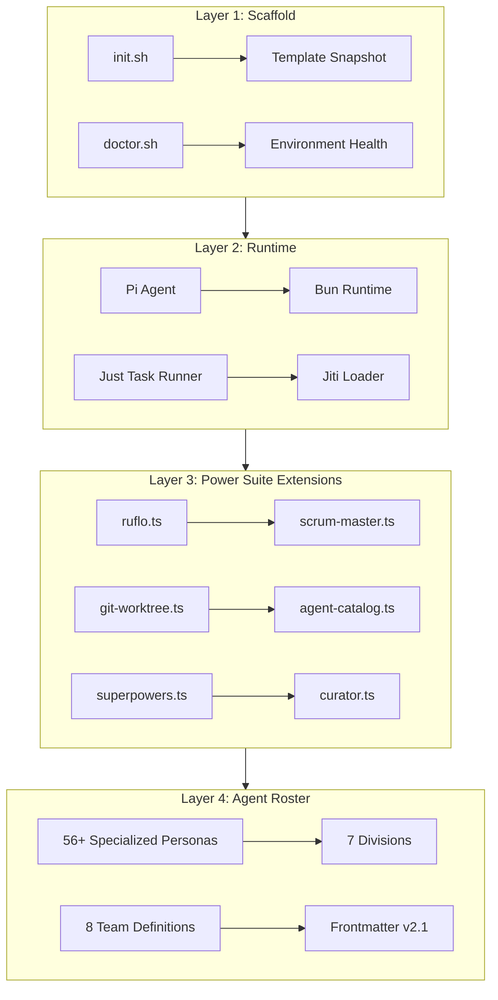

# Technical Design Document: Pi Swarm v1.2.0

| Field          | Value                          |
|----------------|--------------------------------|
| **Version**    | 1.2.0                          |
| **Status**     | Active                         |
| **Created**    | 2026-03-23                     |
| **Author**     | Engineering                    |
| **PRD**        | [docs/PRD.md](./PRD.md)        |

---

## 1. System Architecture Overview

Pi Swarm is a multi-layered orchestration platform designed to scale the Pi Coding Agent from a single-user tool to an enterprise-grade agent swarm.

### 1.1 Architecture Layers

---

## 2. Component Inventory

### 2.1 Extension Suite (25+ Components)
The "Power Suite" provides the high-leverage capabilities of the swarm:

| Component | File | Purpose |
|-----------|------|---------|
| **Scrum Master** | `scrum-master.ts` | Automated task tracking, backlog sync, and sprint health. |
| **Workflow Engine** | `ruflo.ts` | Declarative YAML-based multi-agent choreography. |
| **Worktree Manager** | `git-worktree.ts` | Native support for parallel tasks via Git worktrees. |
| **Project Planner** | `project-planner.ts` | Interactive requirements discovery and automated PRD/TDD generation. |
| **Agent Catalog** | `agent-catalog.ts` | Searchable directory and health monitoring for all 56+ agents. |
| **Superpowers** | `superpowers.ts` | Advanced Git operations (spork, spdiff) and research skill packs. |
| **Upstream Curator** | `curator.ts` | Automated monitoring of external repositories and feature alignment. |

### 2.2 Agent Roster (56 Personas)
Agents are organized into **Divisions** for structural clarity:
- **Engineering (22)**: The core implementation force.
- **Security/QA (5)**: Hardening and validation.
- **Marketing (6)**: Growth and reach.
- **Product (4)**: Scoping and vision.
- **Sales/Ops (6)**: Revenue and process.
- **Data (4)**: Insights and intelligence.
- **Design (4)**: UX/UI and motion.
- **Orchestrators (5)**: High-level management and workflow execution.

---

## 3. Implementation Roadmap

### 3.1 Completed Milestones (v1.0.0 - v1.2.0)
- **[DONE] T-10**: Foundational extension suite (18 items) and initial agents.
- **[DONE] T-20**: Swarm Power Suite implementation (`ruflo`, `scrum-master`, etc.).
- **[DONE] T-25**: Roster expansion to 51+ agents and divisional metadata.
- **[DONE] T-30**: Full rebranding to **Pi Swarm**, standalone CLI integration, and transition documentation.

### 3.2 Phase 3: Swarm Optimization (v1.3.0+)

| Milestone | Task | Description |
|-----------|------|-------------|
| **T-35** | **Extension Generator** | Implement `just new-extension` to automate boilerplate generation for new swarm capabilities. |
| **T-40** | **Bolt-on Marketplace** | Build a dynamic discovery and installation system for external agent/extension packs. |
| **T-45** | **Advanced TUI** | Multi-pane dashboarding for real-time monitoring of parallel agents across worktrees. |
| **T-50** | **Cross-Swarm Memory** | Vector-database integration for shared intelligence between agents in different sessions. |

---

## 4. Operational Standards

- **Paths**: All internal and external paths must use `` as the root.
- **Versioning**: Adhere to Semantic Versioning (SemVer) for all swarm components.
- **Testing**: Every extension must pass import validation and basic behavioral checks in CI.
- **Safety**: `damage-control.ts` must be loaded by default in all production-grade team stacks.
