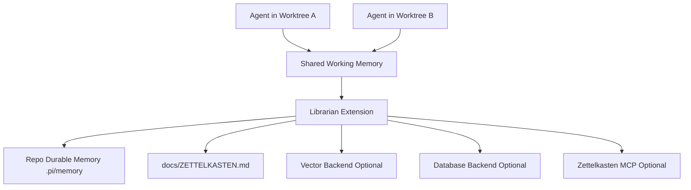

# Technical Design Document: Pi Swarm v1.3.0 Sprint 1

## Related PRD / Issue

This design implements the v1.3.0 PRD in [docs/PRD.md](/Users/admin/pi-swarm/docs/PRD.md), specifically the Sprint 1 execution scope:

- FR-1301 Extension Generator
- FR-1302 Cross-Agent Shared Memory

## Objective

Enable faster extension creation and shared context across parallel worktrees without abandoning the filesystem-first architecture already established in Pi Swarm.

## Scope Alignment

This design covers:

- extension scaffolding via a new `just new-extension <name>` path
- shared-memory foundations for parallel worktrees
- integration with existing repo memory and knowledge-summary surfaces
- diagnostics and tests needed to support those features

This design does not cover:

- a full hosted marketplace
- advanced live TUI dashboards
- mandatory vector or database infrastructure

## Current System / Reuse Candidates

Relevant existing files and patterns to reuse:

- [init.sh](/Users/admin/pi-swarm/init.sh): scaffold and brownfield asset injection
- [justfile](/Users/admin/pi-swarm/justfile): launcher and maintainer command surface
- [extensions/session-wrap.ts](/Users/admin/pi-swarm/extensions/session-wrap.ts): summary sync and external integration pattern
- [docs/MEMORY_SYSTEM.md](/Users/admin/pi-swarm/docs/MEMORY_SYSTEM.md): filesystem-first memory model
- [docs/ZETTELKASTEN.md](/Users/admin/pi-swarm/docs/ZETTELKASTEN.md): curated project knowledge summary
- [docs/TRANSITION.md](/Users/admin/pi-swarm/docs/TRANSITION.md): session handoff log
- [scaffold/v1/.pi/memory/config.yaml](/Users/admin/pi-swarm/scaffold/v1/.pi/memory/config.yaml): backend stub contract
- [tests/e2e/init.test.ts](/Users/admin/pi-swarm/tests/e2e/init.test.ts): scaffold verification
- [tests/e2e/brownfield.test.ts](/Users/admin/pi-swarm/tests/e2e/brownfield.test.ts): brownfield verification

## Proposed Technical Approach

### Architecture Overview

Pi Swarm will use a two-tier memory model:

1. **Shared working memory**
   A filesystem-first store shared across worktrees for the same Git repository.

2. **Durable project memory**
   The tracked `.pi/memory/` folder and curated docs in the repo itself.

The shared working memory should live in a path derived from Git's common directory rather than the current worktree root, so all worktrees for the same repo can access the same memory store.

### Component / Module Changes

#### 1. Extension Generator

New components:

- `scripts/new-extension.sh`
- scaffold templates for:
  - extension source
  - spec file
  - unit test stub

Justfile addition:

- `just new-extension <name>`

Behavior:

- validate extension name
- create `extensions/<name>.ts`
- create `specs/<name>.md`
- create `tests/unit/<name>.test.ts`
- optionally print the exact recipe line to add to the `justfile`

#### 2. Shared Memory Foundation

New component:

- `extensions/librarian.ts`

Responsibilities:

- resolve shared-memory root from `git rev-parse --git-common-dir`
- read and write shared working memory entries
- promote durable knowledge into repo-local `.pi/memory/`
- update `docs/ZETTELKASTEN.md` when durable memory changes are promoted
- optionally sync/index to vector or database backends using `.pi/memory/config.yaml`

#### 3. Shared Working Memory Layout

Proposed shared path:

```text
<git-common-dir>/pi-swarm-memory/
  shared/
    entries/
    index.json
    locks/
```

This storage is:

- shared across worktrees
- local to the developer machine
- not dependent on external infrastructure
- rebuildable from file state

#### 4. Durable Project Memory Layout

Tracked repo memory remains in:

```text
.pi/memory/
  inbox/
  sessions/
  decisions/
  entities/
  runbooks/
  patterns/
  archives/
```

### Interfaces / APIs / Contracts

#### Extension Generator Interface

Command:

```bash
just new-extension my-feature
```

Expected output:

- success/failure message
- created file paths
- follow-up steps

#### Librarian Commands

Planned commands:

- `/memory-set <key> <value>`
- `/memory-get <key>`
- `/memory-search <query>`
- `/memory-sync`
- `/memory-promote <entry-id>`

#### Memory Entry Contract

Shared entries should use file-backed JSON records with stable ids and metadata:

- `id`
- `kind`
- `title`
- `content`
- `created_at`
- `updated_at`
- `source_worktree`
- `tags`
- `promote_to_project_memory`
- `vector_sync_status`
- `db_sync_status`

### Data / Storage / Migration Impact

No destructive migration is required.

New repos and brownfield repos will gain:

- shared-memory feature via runtime code
- durable memory directories already scaffolded
- optional backend config already scaffolded

Shared working memory is intentionally separate from tracked repo memory to avoid Git noise while still enabling parallel coordination.

### Async Jobs / Events / External Integrations

Sync model:

1. write local shared-memory file synchronously
2. optionally promote to repo memory synchronously
3. vector/database sync runs as best-effort follow-up

External integrations:

- Zettelkasten MCP via existing wrap/sync patterns
- vector backend via `.pi/memory/config.yaml`
- database backend via `.pi/memory/config.yaml`

### Security / Permissions / Safety Controls

- no secrets are stored directly in tracked memory files
- backend credentials remain environment-driven
- shared-memory root must remain local-path only
- sync failures must not block canonical filesystem writes

### Performance / Scalability Considerations

- shared-memory reads should start with filesystem queries, not remote calls
- local index files can accelerate lookup but must remain rebuildable
- vector/database backends are optional for larger memory volumes and semantic search

### Failure Modes / Idempotency / Recovery

Potential failures:

- shared-memory lock contention
- corrupted index file
- vector backend unavailable
- database backend unavailable
- promotion conflict when durable memory already changed

Required behavior:

- local canonical write succeeds or fails atomically
- index can be rebuilt from entry files
- external sync failure marks status but does not destroy local memory
- repeated syncs are idempotent through stable entry ids and checksums

## Mermaid Diagrams



## Observability / Validation / Test Strategy

Unit:

- extension generator name validation
- shared-memory path resolution
- entry read/write and promotion behavior
- sync status handling

Integration:

- two worktrees share memory successfully
- doctor detects missing/invalid memory configuration
- session wrap and durable memory remain compatible

E2E:

- `just new-extension foo` creates all expected files
- fresh scaffold contains memory configuration and docs
- brownfield injection preserves existing files while adding new memory surfaces

Runtime proof:

- full `bun test`
- root `doctor.sh`
- generated-project `doctor.sh`
- multi-worktree shared-memory smoke test

## Rollout / Rollback

Rollout:

1. land templates and generator command
2. land librarian shared-memory read/write path
3. land promotion and optional sync hooks
4. land docs and doctor validation

Rollback:

- disable librarian commands
- leave tracked memory layout in place
- ignore shared working memory path until repaired
- external sync backends remain optional and non-blocking

## Risks / Open Questions

- exact locking strategy for concurrent writers
- whether `memory_search` should begin with plain-text search or maintain a local JSON index immediately
- whether promotion should be manual-only in Sprint 1 or partially automatic

## Implementation Slices

1. **Generator Slice**
   - add template files
   - add `scripts/new-extension.sh`
   - add `just new-extension <name>`
   - add unit and E2E tests

2. **Shared Memory Core**
   - add `librarian.ts`
   - resolve git common dir
   - write and read shared-memory entries

3. **Promotion and Summary**
   - promote selected entries to `.pi/memory/`
   - update `docs/ZETTELKASTEN.md`

4. **Optional Backend Sync**
   - vector/db sync hooks
   - status tracking and retry-safe behavior

5. **Docs and Doctor**
   - update docs
   - extend `doctor.sh`
   - add smoke validation

## Acceptance Mapping

- **FR-1301** is satisfied by the new generator command, templates, and tests.
- **FR-1302** is satisfied by shared working memory across worktrees, durable promotion into repo memory, and optional backend sync without making external systems mandatory.
