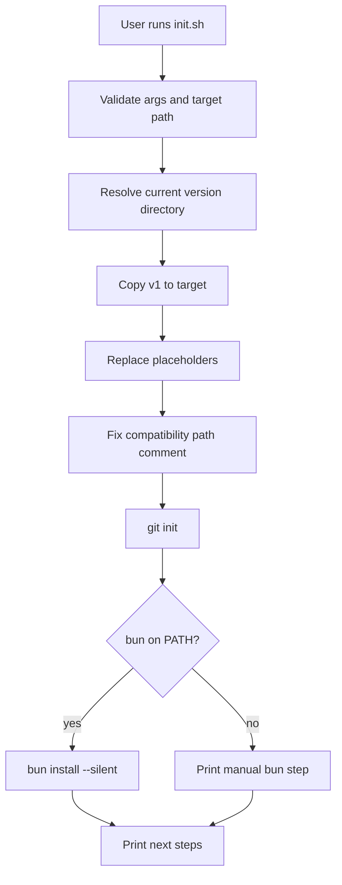
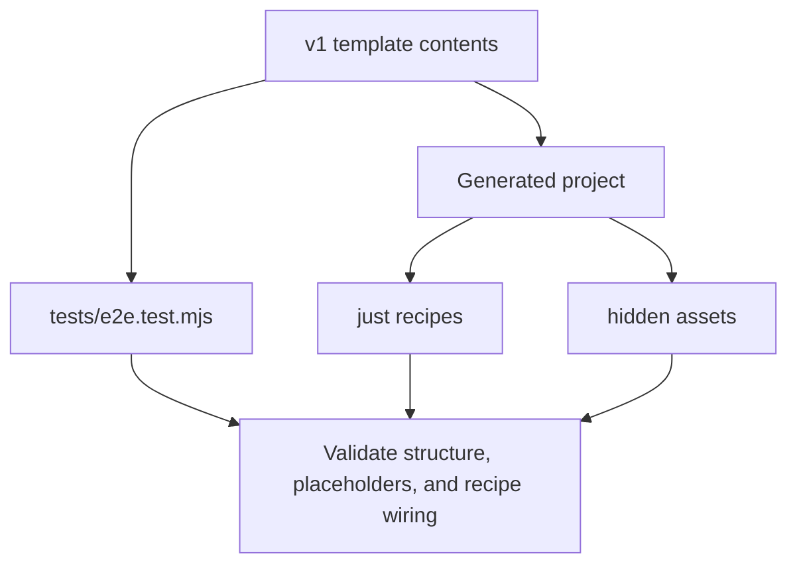

# Technical Design: Pi Scaffold

## Related PRD / Issue
This design accompanies [docs/prd-scaffold-rpg.txt](./prd-scaffold-rpg.txt). The product goal is to keep this repository focused on one job: generate reproducible Pi-based project repositories from versioned scaffold templates.

## Objective
Define the current technical architecture of the scaffold, the component boundaries that should be preserved, and the safest implementation path for future scaffold changes without drifting into full runtime-distribution work.

## Scope Alignment
This design covers:

- versioned template storage under `vN/`
- project generation through `init.sh`
- placeholder replacement and slug generation
- git/bootstrap behavior after copy
- generated project runtime surface packaging
- scaffold E2E validation
- documentation alignment for scaffold and brownfield usage

This design does not cover:

- bundling or installing the upstream `pi` CLI
- runtime version pinning, wrapper launchers, or doctor commands
- packaging the scaffold as a standalone team distro
- changes to Pi core internals

## Current System / Reuse Candidates
- [init.sh](../init.sh): current entry point for project generation; already performs validation, copy, placeholder replacement, git init, optional `bun install`, and next-step output.
- [README.md](../README.md): root scaffold definition and usage entry point.
- [v1/](../v1/README.md): canonical current template version containing the generated project payload.
- [v1/VERSION](../v1/VERSION): version metadata surfaced during generation.
- [v1/package.json](../v1/package.json): generated project package metadata and dependencies.
- [v1/justfile](../v1/justfile): generated project runtime recipes that map to extension stacks.
- [v1/.env.sample](../v1/.env.sample): generated project environment guidance.
- [v1/.pi/](../v1/.pi/settings.json): generated Pi settings, agents, themes, and skill placeholders.
- [v1/.claude/](../v1/.claude/commands/prime.md): generated prompt/command assets.
- [v1/.github/workflows/ci.yml](../v1/.github/workflows/ci.yml): generated CI baseline.
- [v1/bolt-ons/agency-full/install.sh](../v1/bolt-ons/agency-full/install.sh): current pattern for optional bolt-on installation.
- [tests/e2e.test.mjs](../tests/e2e.test.mjs): current product-level verification harness.
- [package.json](../package.json): root test entry point.

## Proposed Technical Approach
### Architecture Overview
The scaffold should remain a thin generator around versioned template directories:

1. A versioned template directory such as `v1/` contains the exact files a generated project should receive.
2. `init.sh` is the only required generation entry point at the root.
3. `init.sh` copies the selected template, applies project-specific substitutions, and performs lightweight local bootstrap actions.
4. Generated projects rely on packaged assets inside the copied template, not on additional scaffold-side runtime logic.
5. The Node E2E harness validates generated output and documented recipe wiring.
6. Meaningful scaffold changes create a new version directory rather than mutating old versions in place.

This keeps the scaffold understandable: template contents live in `vN/`; generation logic lives in `init.sh`; verification lives in `tests/`.

### Component / Module Changes

#### 1. Template version boundary
Primary ownership:

- `v1/`
- future `v2/`, `v3/`, etc.

Responsibilities:

- store complete generated-project contents
- isolate old versions from future changes
- keep all hidden assets and runtime surfaces inside the version directory

Design rule:
- no scaffold feature should depend on reconstructing missing template files at generation time; the version directory must already be complete

#### 2. Generation entry point
Primary ownership:

- `init.sh`

Responsibilities:

- resolve scaffold root and current version path
- validate input arguments and filesystem preconditions
- copy the selected template into the target directory
- call replacement logic for project-specific values
- perform git initialization
- optionally run `bun install`
- emit next-step guidance

Design rule:
- keep `init.sh` procedural and explicit; do not hide core generation logic behind multiple indirections unless complexity materially grows

#### 3. Replacement and normalization logic
Current embedded logic in `init.sh`:

- project slug generation
- literal placeholder replacement
- one-off path comment correction for `extensions/pure-focus.ts`

Responsibilities:

- ensure generated files are project-specific where intended
- preserve template readability while keeping the generation step simple

Recommended evolution path:
- if replacement rules expand beyond the current two placeholders plus one compatibility fix, extract helper functions into a sourced shell library such as `scripts/lib/scaffold.sh`
- until then, keep logic inline to minimize moving parts

#### 4. Generated project runtime surface
Primary ownership:

- `v1/justfile`
- `v1/package.json`
- `v1/.env.sample`
- `v1/extensions/`
- `v1/.pi/`
- `v1/.claude/`

Responsibilities:

- define what a generated project can run immediately after scaffold generation
- package the extension stacks and support files the docs claim exist
- keep recipe names and command wiring stable enough for docs and tests

Design rule:
- generated runtime behavior should be derived from template contents only; `init.sh` should not synthesize runtime files dynamically

#### 5. Optional bolt-on surface
Primary ownership:

- `v1/bolt-ons/`

Responsibilities:

- provide optional post-generation add-ons
- remain separate from the base scaffold path

Design rule:
- bolt-ons may assume the generated project layout, but the base scaffold must not depend on them

#### 6. Verification harness
Primary ownership:

- `tests/e2e.test.mjs`
- root `package.json`

Responsibilities:

- validate argument handling and filesystem safety in `init.sh`
- validate hidden asset packaging
- validate placeholder substitution
- validate runtime recipe wiring with stubbed binaries
- validate bolt-on compatibility with generated project layout

Design rule:
- prefer temp-directory E2E tests over implementation-coupled tests, because the product is the generated output and command behavior

### Interfaces / APIs / Contracts

#### Scaffold CLI contract
Current interface:

```bash
./init.sh <project-name> [target-dir]
```

Contract:

- requires `project-name`
- uses current directory when `target-dir` is omitted
- fails if the current version directory is missing
- fails if the target directory already exists
- prints the template version and target path
- leaves the generated project ready for `cp .env.sample .env` and Pi usage

Compatibility rule:
- changes to the CLI shape should be rare and documented in root README plus tests

#### Template placeholder contract
Current placeholders:

- `pi-swarm`
- `{{project-name}}`

Contract:

- `pi-swarm` is for human-readable display values
- `{{project-name}}` is for slug-style package naming
- replacements are literal, not schema-aware

Compatibility rule:
- adding new placeholders requires explicit test coverage and documentation

#### Generated runtime contract
Current contract:

- generated project includes `justfile`, `package.json`, `.env.sample`, `extensions/`, `.pi/`, `.claude/`, and `.github/`
- generated recipes invoke `pi` directly with packaged extension file paths
- generated project expects local availability of `pi`, `bun`, and `just`

Compatibility rule:
- docs and tests must change in the same slice when recipe names or required asset paths change

### Data / Storage / Migration Impact
There is no database or persistent service state.

Persistent artifacts are filesystem-based:

- scaffold source files at repo root
- versioned template directories such as `v1/`
- generated project directories created by `init.sh`
- temporary test directories created during E2E runs

Migration model:

- old scaffold versions remain immutable
- new scaffold changes land in new version directories when the change is meaningful
- generated projects are not auto-migrated by the scaffold repo

### Async Jobs / Events / External Integrations
- All scaffold operations are synchronous local shell or Node execution.
- External command integrations:
  - `git init`
  - optional `bun install`
  - generated-project use of `pi`
  - optional bolt-on use of `gh` and `curl`

Design rule:
- external integrations should be stub-friendly in tests and fail with clear prerequisite messages

### Security / Permissions / Safety Controls
- `init.sh` must not overwrite existing directories.
- Generated `.env` values are not created automatically; users copy from `.env.sample`.
- Tests should use fake credentials and stubbed binaries only.
- Bolt-on installers must fail safely when required CLIs are missing.
- Any future generated-file mutation should stay inside the chosen target directory.

### Performance / Scalability Considerations
- Scaffold generation should remain I/O bound and quick for normal template sizes.
- Running `bun install` is optional and should not block project creation when Bun is unavailable.
- Tests should favor isolated temp directories and short-lived fake binaries to keep CI fast.
- Template size growth across versions is acceptable as a tradeoff for reproducibility, but maintainers should watch for unnecessary large assets.

### Failure Modes / Idempotency / Recovery
- Missing `project-name`:
  - `init.sh` exits with usage guidance
- Missing template directory:
  - `init.sh` exits before creating output
- Existing target directory:
  - `init.sh` exits before copy and does not mutate existing files
- Missing Bun:
  - generation succeeds and prints manual next step
- Placeholder drift:
  - E2E tests should detect unreplaced tokens in generated files
- Missing hidden assets:
  - E2E tests should detect absent `.pi/`, `.claude/`, or `.github/` content
- Bolt-on prerequisite missing:
  - installer exits with explicit prerequisite error

Recovery model:
- rerun generation with a different target directory
- fix the template or script in the scaffold repo, then rerun tests
- create a new scaffold version when behavior changes materially

## Mermaid Diagrams





## Observability / Validation / Test Strategy
- Keep product validation in Node E2E tests because the primary artifact is a generated filesystem tree.
- Continue stubbing `bun`, `pi`, `gh`, and `curl` on `PATH` for deterministic coverage.
- Cover these required scenarios:
  - usage failure on missing args
  - refusal to overwrite existing target
  - successful generation with hidden assets present
  - placeholder replacement correctness
  - `bun install` behavior when Bun exists
  - generated docs and CI expectations
  - bolt-on installer compatibility
- Keep real-Pi model discovery checks opt-in or best-effort, because they rely on upstream CLI behavior and local availability.

Recommended next test slices if scaffold complexity increases:

- helper-level tests for slug generation and placeholder replacement if extracted from `init.sh`
- version-selection tests if the scaffold later supports non-default version targeting
- release-check tests that ensure new scaffold versions include required files before shipping

## Rollout / Rollback
Rollout:

1. Make scaffold changes in the active development branch.
2. Update tests and docs in the same slice.
3. If the change is materially behavior-changing, create a new version directory rather than mutating `v1/`.
4. Verify generation via E2E before merging.

Rollback:

- revert doc or script changes before release if tests fail
- if a bad scaffold version ships, direct users back to the prior version directory or prior tag
- do not mutate old version directories as a rollback mechanism

## Risks / Open Questions
- The current scaffold always targets `v1`; if version selection is added later, the CLI contract will need a deliberate expansion.
- The one-off `pure-focus.ts` path fix suggests some template cleanup debt; if more exceptions appear, replacement logic should be formalized.
- The richer the generated template becomes, the easier it is for contributors to confuse scaffold scope with bundled distro scope; docs and review discipline need to keep that boundary intact.

## Implementation Slices

### Slice 1: Core scaffold contract
- Maintain root README, scaffold PRD, and this TDD as the source of truth
- Keep `init.sh` aligned with documented CLI behavior

Dependencies:
- none

### Slice 2: Template completeness
- Keep `v1/` complete, including hidden directories and runtime files
- Ensure `VERSION`, `README`, `justfile`, `extensions`, `.pi`, `.claude`, and `.github` stay present

Dependencies:
- Slice 1

### Slice 3: Generation correctness
- Maintain placeholder replacement, slug generation, git init, and optional Bun bootstrap behavior
- Minimize special-case replacement logic

Dependencies:
- Slices 1-2

### Slice 4: Validation coverage
- Expand or refine E2E coverage when scaffold behavior changes
- Keep doc assertions tied to concrete command and structure guarantees

Dependencies:
- Slices 1-3

### Slice 5: Versioned evolution
- Introduce `v2/` and later versions when changes are materially behavior-changing
- Preserve older directories intact

Dependencies:
- Slices 1-4

## Acceptance Mapping
- PRD: template asset packaging
  - Satisfied by the `v1/` version boundary and generated runtime surface modules
- PRD: project generation
  - Satisfied by `init.sh` CLI, placeholder replacement, and post-copy initialization flow
- PRD: versioned reproducibility
  - Satisfied by immutable `vN/` directories plus version signaling through `VERSION`
- PRD: validation and documentation
  - Satisfied by root and template READMEs plus `tests/e2e.test.mjs`
