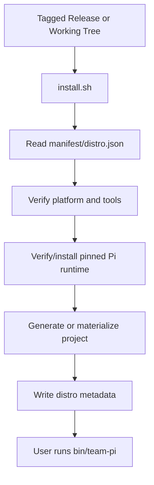
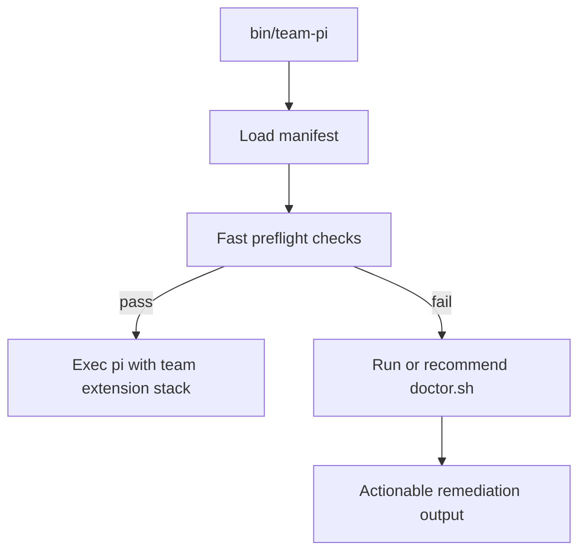

# Technical Design: Pi Team Distro Packaging Layer

> Status: Historical exploratory TDD. The canonical full team distro technical design is `docs/tdd-company-pi-distro.md`. This file remains for reference only.

## Related PRD / Issue
This design implements the PRD in [docs/prd-team-distro.md](./prd-team-distro.md). The business goal is to turn the current scaffold into a downloadable, repeatable team distro with a pinned upstream Pi runtime contract, one-command setup, and product-level validation.

## Objective
Add a thin packaging and support layer on top of the existing scaffold so maintainers can ship a tagged release and end users can install, validate, generate, and launch the team-standard Pi environment without manual runtime guesswork.

## Scope Alignment
This design covers:

- runtime manifesting and compatibility checks
- install and doctor CLI flows
- a team-owned wrapper launcher
- release packaging
- generated-project metadata
- product-level smoke tests

This design does not change:

- Pi core internals
- extension behavior inside the existing `v1/` stack, except where launch wiring must reference the wrapper/manifest
- provider authentication semantics beyond validation and guidance

## Current System / Reuse Candidates
- [init.sh](../init.sh): existing template generator; already handles placeholder replacement, git init, and optional `bun install`.
- [v1/](../v1/README.md): current distributable asset set; includes docs, extensions, `.pi/`, `.claude/`, CI, and environment template.
- [v1/justfile](../v1/justfile): current launch surface; recipes call `pi` directly and show the extension stacks we should preserve.
- [v1/.env.sample](../v1/.env.sample): current provider/auth guidance; should remain the source for generated env defaults.
- [v1/.pi/settings.json](../v1/.pi/settings.json): current packaged Pi settings; can be extended with distro metadata references if needed.
- [v1/bolt-ons/agency-full/install.sh](../v1/bolt-ons/agency-full/install.sh): existing installer pattern for optional assets; useful as a style reference for shell UX and file placement.
- [tests/e2e.test.mjs](../tests/e2e.test.mjs): current automated coverage for scaffold generation; best place to extend with product-install and wrapper tests.
- [package.json](../package.json): current root test harness; can remain the entry point for product-level Node-based tests.

## Proposed Technical Approach
### Architecture Overview
Add a new distro layer that sits above the scaffold foundation:

1. A version manifest defines the supported Pi version, required local tools, supported operating systems, and packaged stack metadata.
2. An installer reads the manifest, verifies or installs prerequisites, and materializes a ready-to-use workspace.
3. A doctor command performs the same checks independently and supports both human-readable and machine-readable output.
4. A wrapper launcher validates the environment at runtime and then forwards execution to `pi`.
5. Release packaging bundles the foundation assets plus the distro layer into a reproducible artifact.
6. Product-level tests exercise the install, doctor, wrapper, and generated-project flows.

### Component / Module Changes

#### 1. Distro manifest
Add a repo-level manifest file, for example `manifest/distro.json`, with fields such as:

- `distroVersion`
- `templateVersion`
- `piVersion`
- `bunVersionRange`
- `justVersionRange`
- `supportedOs`
- `defaultLaunchRecipe`
- `supportedProviders`
- `releaseArtifactName`

Add a template copy of the same metadata inside `v1/.pi/distro.json` so generated projects retain the runtime contract that created them.

Responsibility:
- single source of truth for compatibility and release metadata

#### 2. Shared shell helpers
Add `scripts/lib/common.sh` for shared shell behavior:

- colored/status output
- platform detection
- semantic-version comparison
- command existence checks
- manifest parsing helpers
- safe temp directory handling

Responsibility:
- eliminate duplicated shell logic across install, doctor, and packaging scripts

#### 3. Installer surface
Add `install.sh` at repo root and structure its logic under `scripts/install/`.

Suggested split:

- `install.sh`: CLI entry point
- `scripts/install/prereqs.sh`: verify/install `bun`, `just`, and `pi`
- `scripts/install/materialize.sh`: copy scaffold payload to target path
- `scripts/install/post_install.sh`: write generated metadata, symlinks, and next-step output

Primary behaviors:
- accept a target directory and non-interactive flags
- verify the current platform is supported
- read the distro manifest
- verify or install required tools
- ensure the required Pi version is present
- copy the scaffold payload or invoke `init.sh` where appropriate
- emit a deterministic success summary

Preferred implementation choice:
- reuse `init.sh` for new-project generation instead of reimplementing placeholder handling
- let the installer call `init.sh` when the user wants a generated project
- reserve direct archive extraction for packaging the distro itself

#### 4. Doctor surface
Add `doctor.sh` at repo root with support helpers under `scripts/doctor/`.

Suggested checks:

- platform support
- required commands available
- version range compliance for `pi`, `bun`, `just`
- required project files present
- manifest readable
- `.env` present or missing
- provider visibility checks via `pi --list-models` or provider-scoped checks when auth is expected

Output modes:

- human-readable default
- `--json` for CI and smoke tests
- non-zero exit on blocking failures

Responsibility:
- be the first support tool recommended by docs and wrapper failures

#### 5. Wrapper launcher
Add `bin/team-pi` as the stable command surface for the distro.

Primary behaviors:

- resolve the repo root or generated-project root
- locate and parse the manifest
- run fast preflight checks
- optionally call `doctor --quick` on failure conditions
- map friendly commands or default recipes to the existing `pi -e ...` launch pattern
- forward all remaining CLI args to the Pi binary

Wrapper contract:

- default behavior should preserve the current recommended stack, likely the equivalent of `just ext-sentry-agent-team` or another explicitly chosen default from the manifest
- pass-through mode must allow advanced users to forward raw args to `pi`
- `--doctor` or `doctor` subcommand should route to the doctor surface

#### 6. Template and recipe changes
Update these foundation assets to point at the distro contract:

- `init.sh`: write `v1/.pi/distro.json` into generated projects and optionally report the required Pi version in completion output
- `v1/justfile`: add or update recipes to prefer `bin/team-pi` where appropriate in generated projects
- `v1/README.md`: split "scaffold" documentation from "full distro" documentation clearly
- `v1/.env.sample`: add provider guidance tied to `doctor` expectations

The goal is not to replace existing behaviors, but to ensure generated projects carry the compatibility contract and documented launch path.

#### 7. Release packaging
Add `scripts/package-release.sh` plus an optional output directory such as `dist/`.

Packaging outputs:

- versioned `.tar.gz` or `.zip`
- checksum file
- manifest copy
- optional release notes template or changelog extraction

Packaging behavior:

- read `manifest/distro.json`
- stage a clean bundle
- include `v1/`, `init.sh`, `install.sh`, `doctor.sh`, `bin/team-pi`, and required docs
- exclude transient artifacts and local secrets

#### 8. Product-level tests
Extend the Node test harness with new cases, either in [tests/e2e.test.mjs](../tests/e2e.test.mjs) or split into additional files such as `tests/product-install.test.mjs`.

Required test categories:

- manifest validation
- install flow with fake binaries
- doctor failure and success output
- wrapper invocation forwarding expected `pi` args
- generated project includes distro metadata
- release packaging emits expected files

Optional higher-cost tests:

- real `pi --version` compatibility check when Pi is installed locally
- real provider visibility smoke tests behind opt-in env flags

### Interfaces / APIs / Contracts

#### Manifest contract
JSON file consumed by:

- `install.sh`
- `doctor.sh`
- `bin/team-pi`
- packaging script
- tests

Versioning rule:
- manifest fields are append-only for minor releases where possible
- breaking field changes require a distro major version bump

#### Installer CLI
Proposed interface:

```bash
./install.sh [target-dir] [--project-name NAME] [--no-install-deps] [--check-only]
```

Behavior:
- `target-dir` chooses installation location
- `--project-name` triggers template generation semantics
- `--no-install-deps` verifies but does not mutate toolchain
- `--check-only` runs installer validations without copying files

#### Doctor CLI
Proposed interface:

```bash
./doctor.sh [--json] [--quick] [--project-dir PATH]
```

Behavior:
- `--json` emits machine-readable results
- `--quick` skips slower provider/model visibility probes
- `--project-dir` allows checking arbitrary generated projects

#### Wrapper CLI
Proposed interface:

```bash
bin/team-pi [doctor|launch|pi-args...]
```

Behavior:
- no subcommand: launch default team stack
- `doctor`: run doctor
- other args: pass through to `pi` after preflight

### Data / Storage / Migration Impact
No database or service migrations are required.

New persistent files:

- `manifest/distro.json` at repo root
- `v1/.pi/distro.json` inside generated projects
- optional install receipt file such as `.pi/distro-install.json` in generated projects for support/debugging

Migration approach:
- existing generated projects can adopt the distro layer by copying in the new metadata and wrapper files
- no destructive migration is required

### Async Jobs / Events / External Integrations
- Installer and doctor remain synchronous shell commands.
- Packaging is a synchronous release step.
- External interactions:
  - local command execution for `pi`, `bun`, `just`
  - optional network fetch if install supports downloading Pi or release artifacts
  - provider visibility checks through Pi CLI commands

No background workers or queues are needed in this phase.

### Security / Permissions / Safety Controls
- Never print secret environment variable values.
- Redact provider key contents in logs and JSON output.
- Do not auto-write provider credentials.
- Use explicit `--yes` or non-interactive flags before mutating developer machines.
- Keep wrapper behavior transparent: log the chosen path and command shape, but not secrets.
- Validate that install targets are not accidentally nested in unsafe or existing paths unless explicitly allowed.

### Performance / Scalability Considerations
- All commands are local and should complete quickly on normal repos.
- `doctor --quick` should return in seconds.
- Slow provider discovery calls should be optional or cached only if needed later.
- Packaging should be deterministic and operate on a small repo footprint.

### Failure Modes / Idempotency / Recovery
- Missing tool:
  - installer stops or installs if allowed
  - doctor returns blocking failure with remediation
- Wrong Pi version:
  - wrapper refuses launch until fixed
  - doctor identifies expected and actual versions
- Missing project assets:
  - wrapper and doctor fail before runtime launch
- Missing `.env` or provider auth:
  - launch may still proceed if not strictly required for the chosen model, but doctor marks degraded readiness
- Partial install:
  - installer writes an install receipt only after successful completion
  - rerunning installer is safe and should repair missing pieces
- Offline mode:
  - installer can verify local prerequisites but cannot fetch remote artifacts; this is surfaced clearly

## Mermaid Diagrams





## Observability / Validation / Test Strategy
- Add unit-like shell tests through the existing Node harness by stubbing binaries on `PATH`.
- Validate manifest parsing and version mismatch behavior with deterministic fixtures.
- Capture wrapper invocations to assert the expected forwarded `pi -e ...` arguments.
- Add release-packaging tests that assert archive contents and checksum generation.
- Keep the current real-Pi tests as opt-in smoke checks when `pi` is present.
- For internal rollout, require evidence from:
  - clean-machine install on macOS
  - clean-machine install on Linux
  - wrong-version doctor failure
  - successful wrapper launch in a generated project

## Rollout / Rollback
Rollout:

1. Add manifest and metadata to the scaffold without changing default launch behavior.
2. Ship doctor and wrapper, then update docs to prefer them.
3. Ship installer and release packaging.
4. Require clean-install smoke tests for tagged releases.
5. Promote the packaged distro as the primary team onboarding path.

Rollback:

- If the wrapper or installer misbehaves, users can still call `pi` directly with the documented extension recipes.
- Tagged releases remain immutable; rollback is a matter of redistributing the prior working release.
- Because no persistent data migrations occur, reverting is operationally simple.

## Risks / Open Questions
- The exact upstream Pi installation mechanism is intentionally abstracted behind the installer until maintainers choose whether to rely on a package manager, GitHub release, or source-based install path.
- The default wrapper recipe must be chosen explicitly; current docs suggest multiple candidate stacks.
- If provider visibility checks prove slow or flaky, the doctor may need a tiered quick/full mode from day one.

## Implementation Slices

### Slice 1: Manifest and compatibility contract
- Add `manifest/distro.json`
- Add `v1/.pi/distro.json`
- Update `init.sh` to preserve/write manifest-derived metadata

Dependencies:
- none beyond current scaffold foundation

### Slice 2: Doctor command
- Add shared shell helpers
- Implement `doctor.sh`
- Add tests for missing tools, bad version, and missing project assets

Dependencies:
- Slice 1

### Slice 3: Wrapper launcher
- Add `bin/team-pi`
- Wire wrapper to manifest and doctor
- Update docs and generated recipes to reference the wrapper

Dependencies:
- Slices 1-2

### Slice 4: Installer
- Add `install.sh` and install helpers
- Reuse `init.sh` for project generation path
- Add tests for clean-path install and rerun idempotency

Dependencies:
- Slices 1-3

### Slice 5: Release packaging
- Add packaging script and dist outputs
- Add checksum generation
- Add artifact-content tests

Dependencies:
- Slices 1-4

### Slice 6: Product smoke validation and docs
- Expand test coverage
- Update top-level and `v1/` docs to distinguish scaffold vs distro
- Add release checklist

Dependencies:
- Slices 1-5

## Acceptance Mapping
- PRD: single documented install entry point
  - Satisfied by `install.sh` plus release packaging and docs
- PRD: pinned Pi version enforcement
  - Satisfied by manifest contract, doctor checks, and wrapper preflight
- PRD: team-owned wrapper launcher
  - Satisfied by `bin/team-pi`
- PRD: first-run doctor
  - Satisfied by `doctor.sh` with human and JSON outputs
- PRD: preserve scaffold generation value
  - Satisfied by reusing `init.sh` and `v1/` as the generation foundation
- PRD: release artifacts and metadata
  - Satisfied by packaging script, manifest, checksums, and tagged release process
- PRD: product-level validation
  - Satisfied by new Node-driven smoke tests for install, doctor, wrapper, and generated-project flows
